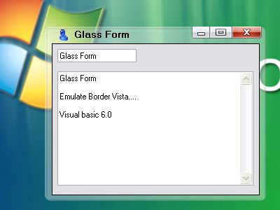



## glassForm

### Description

The style of windows emulates of windows vista.

This code is very simple the api uses of windows,SetLayeredWindowAttributes,CreateRoundRectRgn,etc..
 
### More Info
 

             |
---                |---
**Submitted On**   |2006-09-07 18:23:50
**By**             |[Pakyto](https://github.com/Planet-Source-Code/PSCIndex/blob/master/ByAuthor/pakyto.md)
**Level**          |Intermediate
**User Rating**    |4.8 (24 globes from 5 users)
**Compatibility**  |VB 6\.0
**Category**       |[Coding Standards](https://github.com/Planet-Source-Code/PSCIndex/blob/master/ByCategory/coding-standards__1-43.md)
**World**          |[Visual Basic](https://github.com/Planet-Source-Code/PSCIndex/blob/master/ByWorld/visual-basic.md)
**Archive File**   |[glassForm204092142007\.zip](https://github.com/Planet-Source-Code/pakyto-glassform__1-67560/archive/master.zip)

